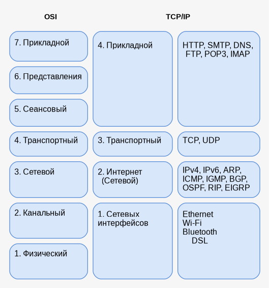

# Сетевые технологии

## Зачем нужны сети

- **Сеть** — способ связать устройства и обмениваться данными
  - Домашний Wi‑Fi, офис, интернет — всё это сети разного масштаба
  - Программы общаются по **протоколам** — соглашениям о формате сообщений

- На этой лекции
  - Модель OSI и стек TCP/IP
  - MAC, IP, маска подсети, DHCP, DNS

---

## Модель OSI и TCP/IP {.center}

{fig-align="center" width="80%"}

---

## Модель OSI — кратко

- **OSI** — эталонная модель из 7 уровней
  - Каждый уровень решает свою задачу и передаёт данные соседнему
  - Удобна для **обучения** и обсуждения, в чистом виде почти не используется

- **TCP/IP** — реальный стек интернета (4 уровня)
  - Прикладной: HTTP, DNS, SMTP
  - Транспортный: TCP, UDP
  - Интернет: IPv4, IPv6, ARP
  - Сетевых интерфейсов: Ethernet, Wi‑Fi

- Где мы сейчас
  - MAC — уровень 2 (канальный)
  - IP, маска, маршрутизация — уровень 3 (сетевой)
  - DHCP, DNS — прикладные протоколы поверх IP

---

## Ethernet

- **Что это**
  - Проводная технология **локальной сети** (LAN)
  - Уровень 2 OSI — канальный; стандарт **IEEE 802.3**
  - Данные идут **кадрами** (frames) по витой паре или оптике

- **Как устроено**
  - Устройства подключены к **коммутатору** (switch)
  - Каждый интерфейс имеет **MAC-адрес** — по нему доставляют кадр внутри LAN
  - Скорости: 100 Мбит/с, 1 Гбит/с, 10 Гбит/с и выше

- **Где встречается**
  - Офис, серверная, домашний ПК «по кабелю»
  - Надёжнее Wi‑Fi: меньше помех, стабильная задержка
  - Посмотреть интерфейс: `ip link show eth0`

---

## Wi‑Fi

- **Что это**
  - Беспроводная технология **локальной сети** (WLAN)
  - Тоже уровень 2; стандарты семейства **IEEE 802.11** (Wi‑Fi 4/5/6…)
  - Данные передаются **радиоволнами** между устройством и точкой доступа

- **Как устроено**
  - **Точка доступа** (AP, роутер) раздаёт сеть; клиенты подключаются по имени (SSID)
  - У каждого интерфейса свой **MAC-адрес** — как у Ethernet
  - Диапазоны: 2,4 ГГц (дальше, но шумнее) и 5 ГГц (быстрее, меньше радиус)

- **Отличия от Ethernet**
  - Мобильность и удобство, но среда общая — возможны помехи и потери
  - ОС может менять MAC при сканировании сетей (privacy)
  - Посмотреть: `iw dev`, `nmcli dev wifi`

---

## MAC-адрес

- **Что это**
  - Аппаратный адрес сетевой карты (Ethernet, Wi‑Fi)
  - Работает **только внутри одной локальной сети** (LAN)
  - Коммутатор доставляет кадр по MAC, а не по имени сайта

- **Формат**
  - 48 бит (6 байт): `AA:BB:CC:DD:EE:FF`
  - Первые 24 бита (OUI) — производитель, остальные — номер устройства
  - Посмотреть: `ip link show`, `ip -br link`

- **Связь с IP**
  - Чтобы отправить пакет соседу, нужен его MAC
  - Протокол **ARP** спрашивает: «у кого IP `192.168.1.5`?» → получает MAC

---

## MAC — практика и безопасность

- **Можно ли поменять MAC?**
  - Да, программно (нужны права администратора)
  - В публичном Wi‑Fi ОС часто подставляет **случайный MAC** против трекинга

- **Два устройства с одним MAC**
  - Коммутатор «прыгает» между портами → обрывы связи
  - Ломаются ARP и DHCP у обоих хостов

- **Разглашение MAC**
  - Не секрет как пароль, но стабильный **отпечаток устройства**
  - Упрощает MAC spoofing и атаки внутри LAN
  - В интернете маршрутизаторы MAC не видят — там работает IP

---

## IPv4

- **Что это**
  - Логический адрес хоста на **сетевом уровне** (L3)
  - Нужен, чтобы доставить пакет **между сетями** (через роутеры)
  - **32 бита** — четыре октета: `192.168.1.10`

- **Частные и публичные**
  - Частные (только внутри LAN): `10.0.0.0/8`, `172.16.0.0/12`, `192.168.0.0/16`
  - Публичный IP — виден в интернете; дома обычно **один на роутере** (NAT)
  - Адрес может меняться: DHCP, смена сети, мобильный интернет

- **Запись и команды**
  - С префиксом (CIDR): `192.168.1.10/24` — сеть и длина маски
  - Посмотреть: `ip -4 addr`, `hostname -I`

---

## IPv6

- **Что это**
  - Новое поколение IP-адресов — **128 бит**
  - Формат: восемь групп по 16 бит: `2001:db8::1`
  - `::` — сокращение последовательности нулей (только один раз в адресе)

- **Зачем нужен**
  - В IPv4 адресов **не хватает** — IPv6 даёт огромное пространство
  - Каждое устройство может иметь **глобальный** адрес без NAT
  - Часто работает **dual-stack**: IPv4 и IPv6 одновременно

- **На практике**
  - Link-local: `fe80::…` — только внутри сегмента LAN
  - Глобальный unicast — маршрутизируется в интернете
  - Посмотреть: `ip -6 addr`, `ping -6 ipv6.google.com`

---

## Маска подсети

- **Зачем**
  - По IP и маске узнаём: адрес в **той же подсети** или в другой
  - От этого зависит: отправить напрямую (ARP) или на **шлюз** (gateway)

- **Пример**
  - IP `192.168.1.10`, маска `/24` (`255.255.255.0`)
  - Сеть: `192.168.1.0`, хост: `.10`
  - `192.168.1.20` — та же подсеть; `192.168.2.5` — другая

- **Запись и команды**
  - CIDR: `/24` = 24 старших бита — номер сети
  - Частые маски: `/8`, `/16`, `/24`; `/32` — один хост
  - Посмотреть: `ip addr`, маршруты: `ip route`

---

## DHCP

- **Что делает**
  - Автоматически выдаёт настройки сети при подключении
  - Обычно: IP, маска, шлюз по умолчанию, DNS-сервер
  - Без DHCP пришлось бы вводить всё вручную на каждом устройстве

- **Как работает (DORA)**
  - **D**iscover — клиент ищет сервер
  - **O**ffer — сервер предлагает адрес
  - **R**equest — клиент принимает
  - **A**cknowledge — сервер подтверждает
  - Адрес выдаётся **в аренду** (lease); потом продлевается или меняется

- **На практике**
  - Сервер DHCP чаще всего встроен в домашний роутер
  - Серверы в дата-центре обычно со **статическим** IP
  - Привязка к MAC помогает выдавать один и тот же адрес одному устройству

---

## TCP vs UDP

::: columns
::: column

### TCP

- **Надёжная** доставка (транспортный уровень, L4)
  - Устанавливает соединение (handshake)
  - Гарантирует порядок и доставку пакетов
  - Повторная отправка при потере

- Когда используют
  - HTTP/HTTPS, SSH, почта, файлы
  - Когда важна целостность данных

- Цена
  - Больше задержка и накладные расходы
  - Медленнее UDP при потерях в сети

:::

::: column

### UDP

- **Быстрая** доставка без гарантий (L4)
  - Без установки соединения
  - Пакеты могут теряться или приходить не по порядку
  - «Отправил и забыл»

- Когда используют
  - DNS-запросы, видеостриминг, VoIP, игры
  - Когда важнее скорость, чем каждый байт

- Цена
  - Приложение само решает, что делать с потерями
  - Проще и легче для коротких сообщений

:::
:::

---

## ICMP

- **Что это**
  - **Internet Control Message Protocol** — служебный протокол сетевого уровня (L3)
  - Работает **поверх IP**, но не переносит пользовательские данные приложений
  - Сообщает об ошибках доставки и помогает диагностике сети

- **Основные типы сообщений**
  - **Echo Request / Echo Reply** — проверка доступности хоста (`ping`)
  - **Destination Unreachable** — маршрут или порт недоступен
  - **Time Exceeded** — пакет «застрял» в петле или истёк TTL (`traceroute`)
  - **Redirect** — роутер подсказывает другой маршрут

- **На практике**
  - `ping 8.8.8.8` — жив ли хост и какая задержка (RTT)
  - `traceroute example.com` — через какие узлы идёт путь
  - Фаерволы часто **блокируют ICMP** — тогда ping молчит, хотя TCP-сервис может работать

---

## DNS

- **Что делает**
  - Переводит **имя** в IP: `example.com` → `93.184.216.34`
  - Людям удобны имена; маршрутизаторы и сокеты работают с IP

- **Как устроено**
  - Иерархия: корень → зона (`.com`, `.ru`) → домен → поддомен
  - Типы записей: `A` / `AAAA` (имя → IP), `CNAME` (псевдоним), `MX` (почта)
  - Клиент спрашивает **резолвер** (часто тот, что выдал DHCP)

- **Практика**
  - Кэш ускоряет повторные запросы
  - `/etc/hosts` может переопределить имя локально
  - Проверить: `dig example.com`, `getent hosts example.com`
  - Если DNS сломан — «интернет есть», но сайты по имени не открываются

---

## SMTP

- **Что это**
  - **Simple Mail Transfer Protocol** — протокол **отправки** почты (прикладной уровень, L7)
  - Передаёт письмо от клиента на сервер и между почтовыми серверами
  - Работает поверх **TCP** — важна надёжная доставка

- **Как устроено**
  - DNS-запись **MX** указывает, какой сервер принимает почту домена
  - Клиент аутентифицируется и передаёт: отправитель, получатель, тело письма
  - Сервер отправителя доставляет письмо на MX-сервер получателя

- **Порты и практика**
  - **587** — отправка с аутентификацией (submission)
  - **25** — обмен между серверами; **465** — SMTPS (TLS)
  - В браузере вы пишете письмо → веб-почта → SMTP; в Thunderbird — тот же протокол

---

## ICMP и POP3

::: columns
::: column

### ICMP

- **Сетевой уровень** (L3), поверх IP
  - Служебные сообщения, не данные приложений
  - Диагностика и отчёты об ошибках маршрутизации

- Основное
  - `ping` — Echo Request / Reply, проверка доступности
  - `traceroute` — Time Exceeded, путь пакета
  - Destination Unreachable — хост или порт недоступен

- На практике
  - Фаервол может блокировать ICMP
  - Сайт открывается, а ping — нет: это нормально

:::

::: column

### POP3

- **Прикладной уровень** (L7), приём почты
  - **Post Office Protocol v3** — забрать письма с сервера на клиент
  - Работает поверх **TCP**

- Как работает
  - Клиент подключается, логин/пароль
  - Скачивает письма в локальный ящик
  - По умолчанию часто **удаляет** копию на сервере

- Порты и альтернатива
  - **110** — POP3; **995** — POP3S (TLS)
  - **IMAP** — письма остаются на сервере, синхронизация папок

:::
:::

---

## HTTP

- **Что это**
  - **HyperText Transfer Protocol** — основной протокол веба (прикладной уровень, L7)
  - Клиент (браузер, приложение) запрашивает ресурс у **сервера**
  - Работает поверх **TCP**; с шифрованием — **HTTPS** (HTTP + TLS)

- **Модель**
  - Запрос → ответ: каждый обмен самодостаточен
  - URL указывает, *что* запрашиваем: `https://example.com/page`
  - Сервер отвечает телом (HTML, JSON, файл) и **кодом статуса**

- **Где встречается**
  - Сайты, мобильные приложения, микросервисы
  - Порты: **80** (HTTP), **443** (HTTPS)

---

## HTTP — запрос и ответ

- **Методы запроса**
  - `GET` — получить ресурс (без изменения на сервере)
  - `POST` — отправить данные (форма, создание записи)
  - `PUT` / `PATCH` — заменить или частично обновить
  - `DELETE` — удалить ресурс

- **Коды ответа (статус)**
  - `2xx` — успех (`200 OK`, `201 Created`)
  - `3xx` — перенаправление (`301`, `302`)
  - `4xx` — ошибка клиента (`404 Not Found`, `401 Unauthorized`)
  - `5xx` — ошибка сервера (`500 Internal Server Error`)

- **Практика**
  - Заголовки: `Content-Type`, `Cookie`, `Authorization`
  - Посмотреть запрос в DevTools браузера → Network
  - Из терминала: `curl -i https://example.com`

---

## REST API

- **Что это**
  - Стиль проектирования **API** поверх HTTP
  - Клиент обращается к **ресурсам** по URL, а не к «процедурам»
  - Ответ чаще всего в формате **JSON** (иногда XML)

- **Идея**
  - Ресурс = сущность: `/users`, `/users/42`, `/orders/7/items`
  - Действие задаёт **HTTP-метод**, а не имя функции в пути
  - Сервер не хранит сессию клиента между запросами (**stateless**)

- **Зачем**
  - Единый понятный контракт для веб-, мобильных и серверных клиентов
  - Удобно кэшировать `GET`, масштабировать и документировать

---

## REST API — ресурсы и CRUD

- **CRUD через HTTP**
  - **C**reate → `POST /users`
  - **R**ead → `GET /users/42`
  - **U**pdate → `PUT` / `PATCH /users/42`
  - **D**elete → `DELETE /users/42`

- **Типичный обмен**
  - Запрос: `GET /api/v1/books/3` + заголовок `Accept: application/json`
  - Ответ: `200` и тело `{"id": 3, "title": "…"}`
  - Ошибка: `404` / `400` и JSON с описанием проблемы

- **Практика**
  - Версия в пути: `/api/v1/…`
  - Документация: OpenAPI / Swagger
  - Проверка: `curl -X POST https://api.example.com/items -d '…'`

---

## Как связано: открытие сайта

- **1.** Wi‑Fi подключён → DHCP выдал IP, маску, шлюз, DNS
- **2.** Браузер: `example.com` → DNS-резолвер → IP сервера
- **3.** Пакет к IP в другой сети → на **шлюз** (роутер), дальше по интернету
- **4.** Внутри LAN соседу → **ARP** находит MAC по IP
- **5.** На канальном уровне кадр уходит с MAC отправителя и получателя

> **MAC** — внутри «комнаты» (LAN). **IP** — адрес в «городе» (интернет). **DNS** — телефонная книга имён. **DHCP** — автоматическая регистрация в сети.
